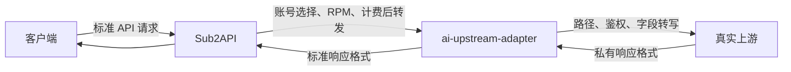

# 独立上游协议转写服务设计

> 状态：设计草案
> 日期：2026-07-29
> 暂定服务名：`ai-upstream-adapter`

## 1. 结论

Grok `task_videos` 兼容逻辑不继续放在 Sub2API 内部。新增一个独立 Go 服务，专门负责“标准协议与不同上游私有协议之间的转写”。

Sub2API 继续负责账号、分组、调度、并发、RPM、计费、内容审核、任务与账号绑定；转写服务只负责 HTTP 协议适配，不成为第二套网关或计费系统。

对 Sub2API 来说，转写服务表现为一个普通的、兼容 xAI/OpenAI 接口的上游。管理员无需再选择“兼容模式”，只需把账号的 Base URL 指向某个适配 profile。



## 2. 服务边界

### 2.1 Sub2API 保留的职责

- 用户 API Key 认证与权限控制。
- 分组、账号选择、模型白名单和账号模型映射。
- 账号并发、RPM、额度、计费和用量记录。
- 内容审核与请求级安全策略。
- 视频任务 ID 与实际账号的绑定，确保查询和下载仍回到创建任务的账号。
- 对客户端暴露 `/v1/videos/generations`、`/v1/videos/{id}` 和 `/v1/videos/{id}/content`。
- 运营后台、审计日志和失败切换策略。

当前约定“只有生成请求计入 RPM”的规则仍由 Sub2API 执行：

- `POST /v1/videos/generations`：RPM `+1`。
- `GET /v1/videos/{id}`：不计 RPM。
- `GET /v1/videos/{id}/content`：不计 RPM。

### 2.2 转写服务负责的职责

- 根据 profile 选择固定的适配器和真实上游地址。
- 转写 HTTP method、path、query、header 和 body。
- 转换上游鉴权格式，例如 `Bearer sk-xxx` 转成裸 `sk-xxx`。
- 处理字段名、类型、默认值、枚举值和模型名差异。
- 规范化任务创建、状态查询和错误响应。
- 安全获取上游返回的签名视频地址并流式返回内容。
- 统一超时、重试边界、日志、指标和链路追踪。

### 2.3 转写服务明确不负责

- 不保存 Sub2API 用户、分组、价格、余额、订单或计费记录。
- 不自行选择业务账号，也不实现账号池调度。
- 不重复保存任务与账号的绑定关系。
- 不接受客户端任意指定上游 URL、Host 或敏感请求头。
- 第一版不实现可执行脚本、任意 JSON 模板或通用表达式 DSL。

## 3. 接入方式

一个转写服务可以承载多个具名 profile。profile 由部署配置静态定义，每个 profile 固定绑定一个适配器、上游地址和安全白名单。

例如在 Sub2API 中创建普通 Grok API Key 账号：

```text
账号类型: Grok API Key
Base URL: http://ai-upstream-adapter:8090/profiles/duoyuanx/v1
API Key: 真实上游的 sk-xxx
自定义请求头: X-Adapter-Token: <内部服务令牌>
```

Sub2API 按原生 xAI 方式发起：

```http
POST /profiles/duoyuanx/v1/videos/generations HTTP/1.1
Host: ai-upstream-adapter:8090
Authorization: Bearer sk-xxx
X-Adapter-Token: <internal-token>
Content-Type: application/json
```

转写服务识别 `duoyuanx` profile 后，请求真实上游：

```http
POST /v1/videos HTTP/1.1
Host: duoyuanx.com
Authorization: sk-xxx
Content-Type: application/json
```

`X-Adapter-Token` 只用于 Sub2API 到转写服务之间的认证，绝不能转发给真实上游；`Authorization` 中携带的才是该账号的真实上游凭据。

生产环境优先把两个服务部署在私有网络，并使用 mTLS 或 `X-Adapter-Token` 进行服务认证。转写服务不应直接暴露到公网。

## 4. Grok task-videos 转写规格

### 4.1 生成请求

标准入站请求：

```json
{
  "model": "grok-imagine-video",
  "prompt": "过来一个男的和她拥抱",
  "aspect_ratio": "9:16",
  "resolution": "720p",
  "duration": 10,
  "image": {
    "url": "https://example.com/input.png"
  }
}
```

profile 配置将 `grok-imagine-video` 映射为 `grok-video-3` 后，真实上游收到：

```json
{
  "model": "grok-video-3",
  "prompt": "过来一个男的和她拥抱",
  "aspect_ratio": "9:16",
  "resolution": "720P",
  "seconds": "10",
  "images": [
    "https://example.com/input.png"
  ]
}
```

具体规则：

| 标准入站 | task-videos 上游 | 规则 |
| --- | --- | --- |
| `/v1/videos/generations` | `/v1/videos` | POST 路径转写 |
| `Authorization: Bearer sk-...` | `Authorization: sk-...` | 只去除 `Bearer ` 前缀 |
| `duration` 或 `seconds` | `seconds` | 输出十进制字符串，范围 `1..15` |
| `resolution` 或 `size` | 同名字段 | 统一值为 `480P` 或 `720P`；有 `resolution` 时优先 |
| `image`、`images`、`reference_images` | `images` | 输出 `array<string>` |
| `image.url`、`image.image_url` | `images[]` | 兼容两种对象字段 |
| 单张字符串图片 | `images[]` | 包装为数组 |
| `aspect_ratio` | `aspect_ratio` | 校验允许的预设值后透传 |

图片成员可为 HTTPS URL 或 `data:image/...;base64,...`。输入数量、单项长度和请求体总大小必须设上限。

适配器只向上游发送已知字段：`model`、`prompt`、`seconds`、`aspect_ratio`、`resolution/size` 和 `images`，未知字段默认丢弃。`task-videos` profile 只允许生成、状态和内容三个操作，不应假装支持图片、视频编辑或视频扩展接口。

### 4.2 模型映射与固定时长

模型分为两类：

1. 业务别名，例如客户端使用 `grok-imagine-video`。是否允许、如何计价仍由 Sub2API 管理；转写 profile 可以将其转换为上游实际模型名。
2. 上游约束，例如模型名本身固定为 6、10、15 秒。这属于协议适配，由转写服务校验。

默认映射示例：

| 入站模型 | 上游模型 | 时长规则 |
| --- | --- | --- |
| `grok-imagine-video` | `grok-video-3` | 使用请求中的 `duration/seconds` |
| `grok-imagine-video-1.5` | `grok-video-3` | 使用请求中的 `duration/seconds` |
| `grok-video-3` | `grok-video-3` | 使用请求中的 `duration/seconds` |
| `grok-1.5-video-6s` | `grok-1.5-video-6s` | 固定 `seconds="6"` |
| `grok-1.5-video-10s` | `grok-1.5-video-10s` | 固定 `seconds="10"` |
| `grok-1.5-video-15s` | `grok-1.5-video-15s` | 固定 `seconds="15"` |

固定时长模型的处理原则：

- 请求未传时长：自动补成模型对应时长。
- 请求时长与模型一致：正常转发。
- 请求时长与模型冲突：返回 `400 invalid_request_error`，不静默改写，以免计费或用户预期不一致。

### 4.3 创建响应

真实上游响应：

```json
{
  "id": "task_BZeJ2VegMKIt5utTUEG4EGeWk1SMCux1",
  "status": "processing",
  "status_update_time": 1783179819
}
```

字段已符合当前异步任务契约时可以保留；适配器仍需校验 HTTP 状态、Content-Type、任务 ID 和状态值，不能把 HTML 错误页当成功响应透传。

### 4.4 状态查询

路径保持为：

```text
GET /profiles/duoyuanx/v1/videos/{task_id}
    -> GET https://duoyuanx.com/v1/videos/{task_id}
```

上游可能把视频地址放在以下任一字段：

- `video.url`
- `video_url`
- `metadata.url`

转写服务应将这些字段统一改写为自己的标准内容接口，而不是把真实签名 URL 直接暴露给 Sub2API：

```json
{
  "id": "task_xxx",
  "status": "completed",
  "progress": 100,
  "video": {
    "url": "http://ai-upstream-adapter:8090/profiles/duoyuanx/v1/videos/task_xxx/content"
  },
  "video_url": "http://ai-upstream-adapter:8090/profiles/duoyuanx/v1/videos/task_xxx/content",
  "metadata": {
    "url": "http://ai-upstream-adapter:8090/profiles/duoyuanx/v1/videos/task_xxx/content"
  }
}
```

这样 Sub2API 下载时仍访问该账号配置的标准 `/videos/{id}/content`，不会直接连接未知 CDN，也不会把上游 API Key 发送给 CDN。

### 4.5 视频内容下载

收到：

```text
GET /profiles/duoyuanx/v1/videos/{task_id}/content
```

转写服务执行：

1. 使用该请求携带的上游 API Key 查询 `/v1/videos/{task_id}`。
2. 从 `video.url`、`video_url`、`metadata.url` 中提取签名地址。
3. 按 profile 的 `allowed_content_hosts` 和 SSRF 规则校验地址。
4. 新建不带 `Authorization`、`X-Adapter-Token` 和账号自定义头的下载请求。
5. 可透传合法的单段 `Range`，并流式返回状态码、`Content-Type`、`Content-Length`、`Content-Range` 和 `Accept-Ranges`。
6. 禁止自动跟随重定向；不把签名 URL 的 query 写入日志。

转写服务第一版可以保持无状态：下载时重新查询任务状态，不需要数据库或 Redis。

## 5. Profile 配置

建议使用 YAML 加环境变量引用，配置只表达安全、路由和有限的模型映射；复杂字段转换仍由类型化 Go 适配器完成。

```yaml
server:
  addr: ":8090"
  max_request_body: 16MiB

security:
  adapter_tokens:
    sub2api: "${SUB2API_ADAPTER_TOKEN}"

profiles:
  duoyuanx:
    adapter: grok_task_videos_v1
    upstream_base_url: "https://duoyuanx.com/v1"
    allowed_upstream_hosts:
      - "duoyuanx.com"
    allowed_content_hosts:
      - "storage.deepwl.cn"
    auth:
      inbound: bearer
      outbound: raw
    model_mapping:
      grok-imagine-video: grok-video-3
      grok-imagine-video-1.5: grok-video-3
    fixed_durations:
      grok-1.5-video-6s: 6
      grok-1.5-video-10s: 10
      grok-1.5-video-15s: 15
    default_duration: 8
    duration_range: [1, 15]
    allowed_resolutions: [480P, 720P]
    allowed_operations:
      - video.generate
      - video.status
      - video.content
    timeouts:
      generate: 120s
      status: 30s
      content: 10m
```

如需把公开模型固定映射为 10 秒模型，直接为另一个 profile 配置：

```yaml
profiles:
  duoyuanx_fixed_10s:
    adapter: grok_task_videos_v1
    upstream_base_url: "https://duoyuanx.com/v1"
    model_mapping:
      grok-imagine-video: grok-1.5-video-10s
```

此时客户端仍请求 `grok-imagine-video`，适配器输出 `model=grok-1.5-video-10s` 和 `seconds="10"`。不同固定映射使用不同且带版本的 profile，不在运行时修改同一个 profile 的语义，便于灰度和回滚。

配置校验应在启动阶段失败即退出，包括：

- profile 名重复或格式非法。
- adapter 名不存在。
- 上游 URL 与允许 Host 不一致。
- 非 HTTPS 上游，除非显式启用仅供本地开发的选项。
- 模型映射为空、成环或目标模型不受适配器支持。
- 缺少服务认证配置。

不要允许请求通过 `X-Upstream-URL`、query 参数或 JSON 字段覆盖 profile 的上游地址。

### 5.1 与 Sub2API 的通用元数据契约

独立转写后，Sub2API 只能看到转写前的请求。例如固定时长模型在 adapter 内被确定为 10 秒，而原请求未传 `duration`，Sub2API 可能按默认 8 秒计费。因此 adapter 应通过受信任响应 Header 返回实际执行信息：

```text
X-Protocol-Adapter-Contract-Version: 1
X-Protocol-Adapter-Profile: duoyuanx_fixed_10s
X-Protocol-Adapter-Upstream-Model: grok-1.5-video-10s
X-Protocol-Adapter-Upstream-Endpoint: /v1/videos
X-Protocol-Adapter-Video-Duration-Seconds: 10
X-Protocol-Adapter-Video-Resolution: 720P
X-Protocol-Adapter-Failure-Scope: request|upstream|adapter
```

Sub2API 需要增加一层与具体供应商无关的读取逻辑：

- 只信任管理员明确配置的 adapter Host 返回的这些 Header。
- 用实际时长、清晰度和上游模型完成用量与计费记录。
- 用实际 endpoint 做运营观测，但账号请求仍记录 adapter endpoint 便于排障。
- `Failure-Scope=adapter` 表示转写服务自身故障，不应污染真实上游账号健康度。
- Header 在 Sub2API 内消费后删除，不向公网客户端透出。
- 未收到或校验失败时回退现有请求解析逻辑，并记录元数据缺失指标。

这是迁移所需的最小 Sub2API 通用改动，不包含任何 `duoyuanx` 或 `task_videos` 专用判断。第一版如果不实现该契约，则必须强制客户端显式传入最终计费时长，不能对缺少时长的固定模型自动补值。

## 6. Go 工程结构

建议新建独立仓库，结构如下：

```text
ai-upstream-adapter/
├── cmd/adapter/main.go
├── internal/config/
├── internal/httpserver/
├── internal/registry/
├── internal/adapter/
├── internal/adapters/grok_task_videos/
├── internal/transport/
├── internal/security/
├── internal/observability/
├── internal/problem/
├── testdata/contracts/
├── config.example.yaml
├── Dockerfile
└── go.mod
```

核心操作使用有限枚举，不直接用任意 path 驱动转换：

```go
type Operation string

const (
    OperationVideoGenerate Operation = "video.generate"
    OperationVideoStatus   Operation = "video.status"
    OperationVideoContent  Operation = "video.content"
)
```

适配器接口建议保持类型化：

```go
type Adapter interface {
    Name() string
    Match(method, path string) (Operation, PathParams, bool)
    BuildUpstreamRequest(
        ctx context.Context,
        profile Profile,
        op Operation,
        params PathParams,
        inbound *http.Request,
    ) (*http.Request, error)
    WriteResponse(
        ctx context.Context,
        profile Profile,
        op Operation,
        downstream http.ResponseWriter,
        upstream *http.Response,
    ) error
}
```

通用 transport 统一负责 DNS/SSRF 校验、超时、重定向、Header 白名单、连接池、日志和 trace；具体 adapter 只处理某种上游的协议差异。

后续新增场景时，增加 `internal/adapters/<name>` 并注册，不修改已有适配器。例如：

- 另一家 Grok 视频任务协议。
- 图片生成字段和响应格式转换。
- 上游只支持 multipart、下游使用 JSON 的转换。
- 异步任务与同步响应之间的规范化。

不建议第一版做“配置一个 JSON 模板就能执行任意转换”的规则引擎。类型化适配器更容易做输入校验、密钥隔离、安全审计和稳定的契约测试。

## 7. HTTP 与错误契约

建议统一为 OpenAI 风格错误：

```json
{
  "error": {
    "type": "invalid_request_error",
    "code": "invalid_video_duration",
    "message": "duration must be between 1 and 15 seconds"
  }
}
```

状态码约定：

| 场景 | 状态码 |
| --- | --- |
| 入站字段、模型或时长非法 | `400` |
| Adapter 服务认证失败 | `401` 或 `403` |
| profile、操作或任务路径不存在 | `404` |
| 上游明确返回业务错误 | 保留安全的 `4xx/5xx`，并规范化 body |
| 上游连接失败、响应非法 | `502` |
| 上游超时 | `504` |

重试原则：

- 生成 POST 默认不自动重试，避免重复创建和重复计费。
- 只有具备端到端 Idempotency-Key 且确认上游支持时，才允许生成重试。
- 状态 GET 可对连接建立失败、`502/503/504` 做少量退避重试。
- 内容下载在向客户端写出任何字节后不重试。

适配器必须保留上游的 `401`、`403`、`429`、`Retry-After` 和 request ID 语义，不能统一吞成 `502`。否则 Sub2API 无法正确执行账号健康、限流等待和失败切换。adapter 自身故障与真实上游故障通过 `X-Protocol-Adapter-Failure-Scope` 区分。

## 8. 安全要求

### 8.1 URL 与 SSRF

- 真实上游地址只能来自启动配置。
- 默认只允许 HTTPS、443 端口、无 userinfo。
- 对域名解析结果做公网 IP 校验，并防止 DNS rebinding。
- `allowed_upstream_hosts` 和 `allowed_content_hosts` 分开管理。
- 所有状态查询和内容下载禁止自动跟随重定向。
- 本地开发如需 HTTP 或私网地址，必须通过显式环境开关启用，不能成为生产默认值。

### 8.2 Header

- 入站只读取必要的 `Authorization`、`Content-Type`、`Accept`、`Range`、请求 ID 和 trace header。
- 丢弃 `Cookie`、`Host`、`Forwarded`、`X-Forwarded-*` 以及未列入白名单的自定义 header。
- `X-Adapter-Token` 只在服务边界校验后删除。
- 获取签名 CDN 内容时绝不附加上游 Authorization 或账号 Header 覆写。

### 8.3 日志与密钥

- 不记录完整 Authorization、服务令牌、data URI、图片内容或签名 URL query。
- 默认不记录 prompt；排障采样也应先脱敏并由显式配置开启。
- 日志中的账号只能使用不可逆标识或由 Sub2API 传入的内部 account ID。
- 配置文件不写真实密钥，密钥使用环境变量或 Secret Manager 注入。

## 9. 可观测性

结构化日志至少包含：

```text
request_id
trace_id
profile
adapter
operation
inbound_endpoint
upstream_endpoint
requested_model
upstream_model
upstream_status
latency_ms
error_code
```

关键指标：

- `adapter_requests_total{profile,adapter,operation,status}`
- `adapter_request_duration_seconds{profile,adapter,operation}`
- `adapter_upstream_errors_total{profile,code}`
- `adapter_inflight_requests{profile,operation}`
- `adapter_content_bytes_total{profile}`

提供：

- `GET /healthz`：进程存活。
- `GET /readyz`：配置已加载、registry 完整。
- 可选 `GET /metrics`：只监听内部管理端口。

透传 Sub2API 的 request ID 和 W3C trace context，便于从客户端请求追踪到真实上游。

## 10. 测试策略

每个 adapter 必须有契约测试，精确断言：

- 上游 method、path 和 query。
- 鉴权是否正确去掉或增加 `Bearer`。
- Header 白名单与敏感 Header 隔离。
- JSON 字段、类型、默认值、模型映射和固定时长。
- 创建响应、状态响应和错误响应规范化。
- 三种视频 URL 字段的识别与改写。
- 内容下载 Host 校验、无凭据请求、Range 和重定向拒绝。
- 生成 POST 不发生隐式重试。

测试分层：

1. 纯函数单元测试：字段和模型转换。
2. golden contract：输入请求与期望上游请求/下游响应快照。
3. `httptest.Server` 集成测试：模拟真实上游和签名 CDN。
4. 安全测试：私网 IP、DNS rebinding、恶意重定向、Header 注入、超大 body。
5. 默认关闭的真实上游 smoke test：只在人工提供测试密钥时执行。

## 11. 从当前分支迁移

当前 `codex/grok-video-upstream-adapter` 分支中的实现可作为独立服务的行为参考，但不建议直接继续扩展在 Sub2API 内。

### 阶段一：建立独立服务

1. 创建 `ai-upstream-adapter` Go 仓库。
2. 实现 profile registry、通用安全 transport 和 `grok_task_videos_v1` adapter。
3. 先用当前 Sub2API 测试用例整理 golden contracts。
4. 完成生成、查询、内容下载和错误映射。
5. 构建最小容器并加入内部网络。

### 阶段二：灰度接入

1. 在 Sub2API 新建一个普通 Grok API Key 账号。
2. Base URL 指向 `/profiles/duoyuanx/v1`，配置服务认证 Header。
3. 账号模型白名单只放灰度模型，并单独放入测试分组。
4. 验证创建、状态、内容下载、任务账号绑定、计费和“仅生成计 RPM”。
5. 对比转写服务日志中的实际上游路径必须为 `/v1/videos`。

adapter 账号必须使用非空且仅包含视频别名的模型白名单或独立分组，避免它被调度去处理文本、图片、视频编辑等 profile 不支持的请求。

### 阶段三：清理 Sub2API 专用兼容逻辑

灰度稳定后，删除 Sub2API 中只服务于 `task_videos` 的分支逻辑，包括：

- 账号字段 `grok_video_upstream_style`。
- 管理页面“视频上游协议/兼容模式”选择框。
- `account_grok_video_style.go`。
- `grok_video_upstream_adapter.go`。
- scheduler 对 `task_videos` 的协议筛选。
- `task_videos` 专用连接测试探针。

保留对所有 Grok 上游都通用的能力：

- Grok 视频标准入口、任务账号绑定和状态/内容路由。
- 模型白名单、业务模型映射和价格配置。
- 视频时长、清晰度和用量记录。
- 仅生成请求计 RPM 的策略。
- 实际上游 endpoint、延迟和错误观测字段。

清理前必须先确认普通账号指向 adapter 时，Sub2API 不再依赖 `task_videos` 标记即可完成全部流程。

### 回滚

灰度账号与现有账号并存。出现问题时禁用 adapter 账号并恢复原账号，不迁移任务数据库、不修改历史用量。已经由 adapter 账号创建的任务应在保留其账号配置期间继续支持查询和下载。

## 12. MVP 验收标准

- Sub2API 管理页面无需“兼容模式”，只配置普通账号 Base URL。
- 示例 `grok-imagine-video` 请求被准确转成 `grok-video-3`、字符串秒数、规范化清晰度和图片数组。
- 6/10/15 秒固定模型会补齐时长并拒绝冲突值。
- 创建请求真实上游 path 为 `/v1/videos`，查询 path 为 `/v1/videos/{id}`。
- 真实上游收到裸 `Authorization: sk-...`，其他请求不得泄漏该凭据。
- 状态中的签名 URL 被改写到 adapter 内容接口。
- 内容下载经过 Host/SSRF 校验，不带账号鉴权，支持安全 Range 流式响应。
- 只有生成请求由 Sub2API 计入 RPM，查询和下载不计入。
- 生成 POST 无隐式重试，错误响应可追踪且不泄漏密钥。
- adapter 返回的实际时长/清晰度能被 Sub2API 正确计费，固定 10 秒模型不会按默认 8 秒记录。
- adapter 故障和真实上游账号故障可区分，不会错误禁用账号。
- 契约、安全和集成测试全部通过。

## 13. 后续扩展原则

每接入一种新上游风格，先回答四个问题：

1. 对外希望维持哪一种标准协议？
2. 变化只涉及配置，还是需要新增类型化 adapter？
3. 哪些差异属于业务路由/计费，必须留在 Sub2API？
4. 哪些外部 URL、Header 和响应内容需要新的安全边界？

新增适配器必须保持“profile 固定上游、代码负责转换、契约测试锁定行为”。当多个适配器出现稳定且完全相同的转换原语后，再抽取有限的共享组件；不要预先建设一个能执行任意逻辑的规则引擎。

此外，Sub2API 的视频任务账号绑定 TTL 必须覆盖上游可能的最长生成与下载生命周期。该绑定仍由 Sub2API 管理，但独立服务上线前应加入长任务测试，避免绑定过期后状态查询或内容下载返回 `404`。
